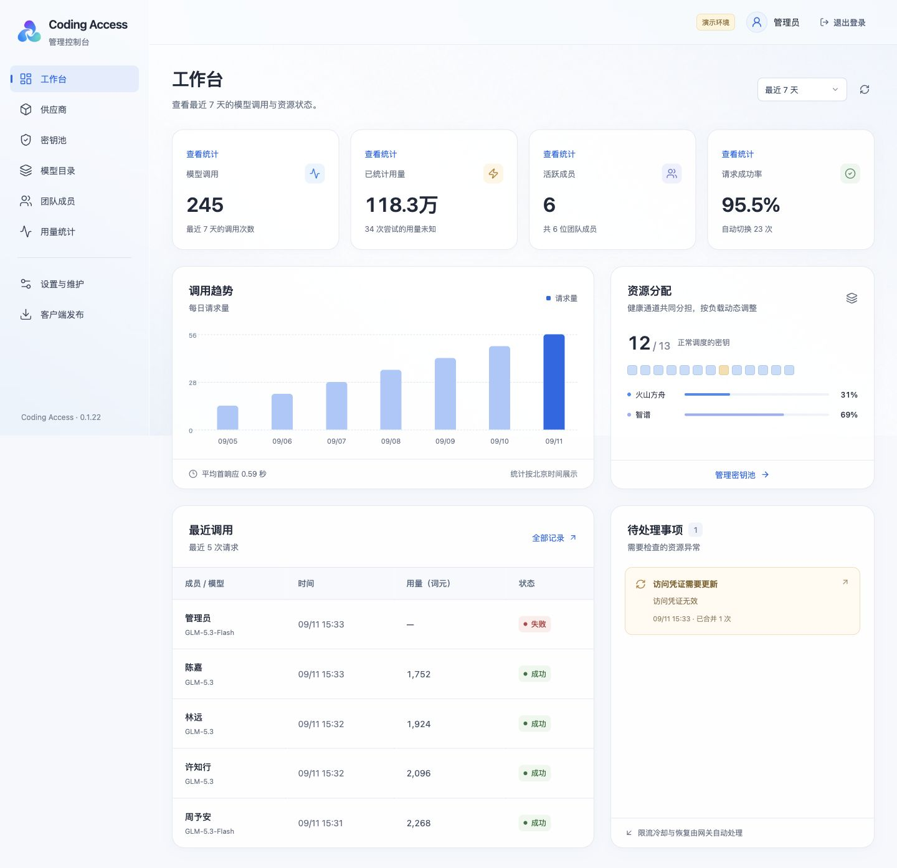
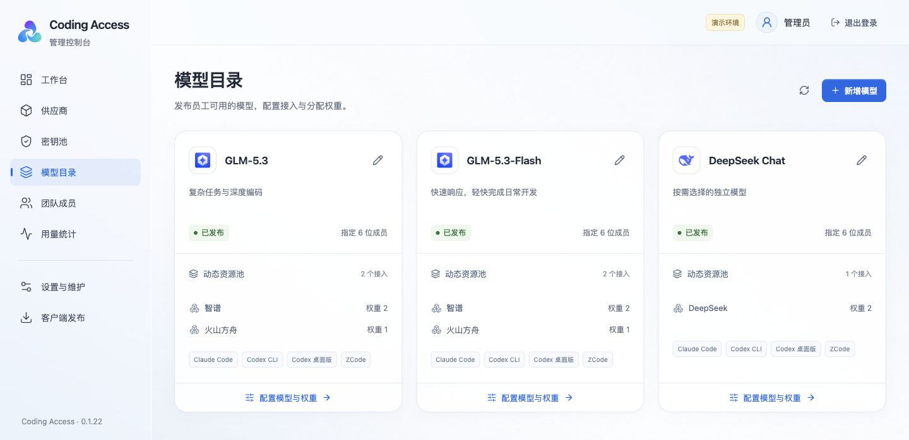
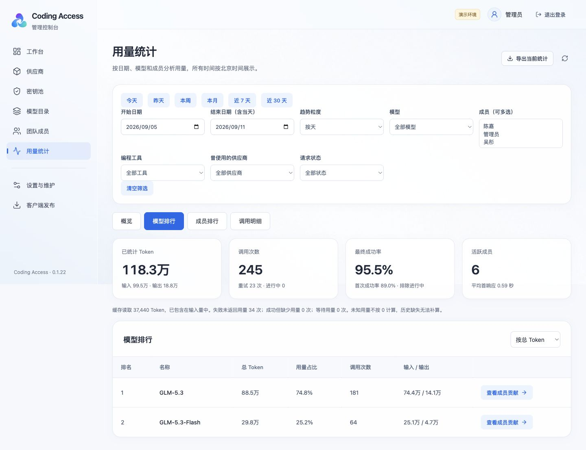

# Coding Access

面向团队的 AI 编程模型接入平台。管理员集中维护供应商、密钥、模型与成员权限，成员通过桌面客户端将团队模型配置到编程工具。

**公开测试版 · 服务端 0.1.22 · Tauri 客户端独立版本。** 适合单实例的团队内网部署。Windows、macOS 的主要安装和使用流程已由内部团队验收，并持续使用两周；这不代表所有系统版本、安装方式和厂商接口都已覆盖。

[部署服务端](deployment.md) · [下载客户端](https://github.com/lgx1103/coding-access/releases/tag/client-v0.2.0-beta.12) · [所有版本](https://github.com/lgx1103/coding-access/releases)

## 界面预览

以下截图来自独立演示环境，成员、用量与调用记录均为虚构数据，不包含公司真实密钥、地址或业务数据。

**工作台：查看团队调用趋势与资源状态。**



<details>
<summary>模型目录：统一发布模型与分配接入</summary>



</details>

<details>
<summary>用量统计：按日期、成员、模型筛选与查看排行</summary>



</details>

## 可以做什么

- **供应商与密钥管理**：独立维护接入地址和产品套餐，调整密钥所属接入、并发、权重与可用范围。
- **模型发布**：填写真实模型 ID、上下文和图片能力，为全体或指定成员发布模型。
- **请求调度**：在同一模型的兼容接入间分配请求，处理限流、冷却与故障切换；已经开始输出的请求不切换重放。
- **用量统计**：按时间、成员和模型查看 Token 用量、趋势、排行及请求明细，支持 CSV 导出。
- **桌面接入**：配置 Claude Code、Codex CLI、ChatGPT 桌面版（原 Codex 桌面版）及 ZCode，提供设置、工具检测、更新和诊断入口。

供应商真实密钥仅由服务端保存，成员使用独立访问凭证。项目不提供模型额度，也不改变供应商套餐权益。

## 快速开始：本机演示

需要 Node.js 22.16+（CI 使用 Node.js 24）和 npm。下载源码并进入项目目录：

```sh
npm ci
npm run build
npm run demo
```

访问 <http://127.0.0.1:4317>，管理员账号 `admin`，演示密码 `DemoAccess2026!`。演示使用独立数据与模拟上游，不消耗真实模型额度。不要将演示作为正式服务公开。

## 正式部署与使用

服务端和客户端分别下载、独立更新：

| 使用者 | 下载文件 | 下一步 |
|---|---|---|
| 管理员 | [服务端 0.1.22](https://github.com/lgx1103/coding-access/releases/tag/server-v0.1.22) 中的 `*-server.tar.gz` | 按[部署说明](deployment.md)在 Linux 服务器安装 |
| Windows x64 成员 | [客户端 beta.12](https://github.com/lgx1103/coding-access/releases/tag/client-v0.2.0-beta.12) 中的 `*-win-x64-setup.exe` | 运行安装程序 |
| Mac Apple Silicon 成员 | 同一客户端 Release 中的 `*-mac-arm64.zip` | 解压，将 App 放入“应用程序” |

`Source code` 是源码，不能直接当作客户端安装包。`.sig` 和 `*-update.tar.gz` 供管理员配置应用内更新使用。当前没有 Intel Mac / Linux 客户端安装包。

1. 服务端：按[部署说明](deployment.md)初始化自己的管理员账号和主密钥。
2. 管理员：创建供应商接入 → 添加密钥 → 创建并发布模型 → 添加成员。
3. 成员：安装适合本机的客户端，输入团队服务地址并登录，选择编程工具和模型。
4. 使用前自行安装对应编程工具。供应商套餐需要支持所选工具、协议和模型。

同一模型可以配置多个接入；Coding Plan 与 Agent Plan 应分别建立接入并使用对应地址和密钥。模型 ID 区分大小写，按厂商实际要求填写。设置上下文不会提升上游模型的真实容量。

## 支持范围与限制

| 项目 | 范围 |
|---|---|
| 服务端 | Node.js + SQLite；提供 Linux Docker 部署方式 |
| 客户端 | Tauri + Rust + 系统 WebView，Windows / macOS；公开安装包以 Release 实际附件为准 |
| 模型接口 | Chat Completions、Responses、Anthropic Messages；转换并非所有原生能力的完整替代 |
| 工具搜索 | Responses 转 Chat Completions 支持客户端执行的 tool_search、动态工具定义、历史回放及流式回复 |
| 托管能力 | OpenAI 托管工具搜索及其他未适配托管工具需原生兼容接入 |
| 对话历史 | 转换通道需要完整历史；previous_response_id 不提供跨协议状态恢复 |
| 统计 | 以厂商返回用量为准，未知值不等于零；不是账单结算系统 |
| 部署规模 | 面向单团队、单实例；未提供多租户隔离或跨实例共享调度租约 |

本项目为独立工具，与 OpenAI、Anthropic 及各模型供应商不存在隶属或背书关系。服务商标识用于识别接入，相关商标不属于项目 MIT 授权范围。

## 开发

```sh
npm ci
npm run typecheck
npm test
npm run build
```

服务端开发先执行 `npm run setup`，然后 `npm run dev`。桌面开发还需要 Rust 和 Tauri 平台构建依赖，使用 `npm run dev:tauri`；正式客户端使用 `package:tauri:mac` / `package:tauri:win`。旧 Electron 代码保留用于兼容和回归，不作为新版客户端推荐构建入口。

```text
src/server/    服务端、网关、协议、统计
src/web/       管理界面与客户端共享界面
src/shared/    共享类型和规则
src-tauri/     原生桌面客户端
src/desktop/   旧客户端兼容实现
scripts/       初始化、构建、备份及验证
```

## 文档与反馈

- [部署、备份与升级](deployment.md)
- [版本发布与客户端签名](releases.md)
- [验证记录与已知边界](verification.md)
- [贡献指南](../../CONTRIBUTING.md)
- [安全反馈](../../SECURITY.md)
- [版本说明](../../CHANGELOG.md)

报告问题时提供系统、客户端及服务端版本、编程工具版本、复现步骤和脱敏请求 ID。不要提交 API 密钥、数据库、环境文件或私人对话内容。

代码使用 [MIT License](../../LICENSE)，第三方依赖声明见 [THIRD_PARTY_NOTICES.md](../../THIRD_PARTY_NOTICES.md) 与 [Rust 依赖声明](../../src-tauri/THIRD_PARTY_RUST_NOTICES.txt)。

## 作者与联系

我是来自河南郑州的一名程序员。Coding Access 起步于团队日常使用编程工具的需要，希望能帮更多团队方便地接入和管理模型。欢迎交流、反馈问题和一起改进。

QQ 邮箱：[1373942050@qq.com](mailto:1373942050@qq.com)。
